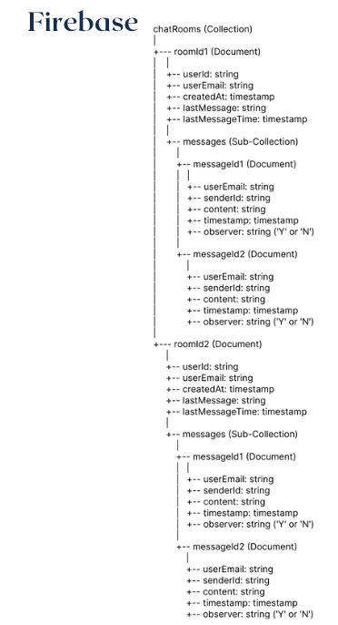

# HanGang-Mate

---

## Table of Contents

- [Overview](#overview)
- [Demo Video](#demo-video)
- [Features](#features)
- [My Roles & Responsibilities](#my-roles--responsibilities)
- [Tech Stack](#tech-stack)
- [Main Packages](#main-packages)
- [System Architecture](#system-architecture)
- [Screen Flow Diagram](#screen-flow-diagram)
- [Screenshots](#screenshots)
- [Database](#database)
- [How to Run](#how-to-run)
- [Contact](#contact)

---

## Overview

HanGang-Mate is a Flutter-based mobile app that predicts parking lot congestion in Yeouido and Ttukseom Hangang Parks using machine learning.  
The app provides real-time parking information and future congestion predictions based on holidays, time slots, and parking lot locations.  
It also offers navigation assistance to help users find parking spots in real time.

- **Team Size:** 5 members  
- **Project Duration:** November 1, 2024 – November 22, 2024

---

## Demo Video

**Links:**  
- [Demo Video](https://youtu.be/GxYjpVGDhHs)

---

## Features

- Real-time parking lot congestion prediction using machine learning
- Provides parking lot information for Yeouido and Ttukseom Hangang Parks
- Navigation guidance to available parking spots
- Real-time chat system with administrators

---

## My Roles & Responsibilities

- Data analysis and preprocessing for Ttukseom parking lot using Python
- Developed machine learning-based congestion prediction model
- Implemented the prediction model using FastAPI
- Built a real-time API server to provide prediction results
- Developed real-time chat system with administrators

---

## Tech Stack

**Frameworks:**  

**Languages:**  

**Database:**  

**Design/Planning:**  

**Tools:**  

---

## Main Packages

- `get`: State management and navigation
- `persistent_bottom_nav_bar`: Bottom navigation bar
- `http`: HTTP requests
- `get_storage`: Local storage management
- `firebase_core`: Core Firebase functionalities
- `cloud_firestore`: Firestore database integration
- `google_maps_flutter`: Google Maps integration
- `flutter_polyline_points`: Polyline routes for maps
- `geolocator`: Geolocation services
- `firebase_auth`: Firebase Authentication
- `google_sign_in`: Google Sign-In integration
- `lottie`: Lottie animations
- `chat_bubbles`: Chat UI widgets
- `gauge_indicator`: Gauge for parking lot status
- `gradient_slider`: Gradient-style slider for UI
- `dots_indicator`: Dots indicator for pagination/progress

---

## System Architecture

---

## Screen Flow Diagram

---

## Screenshots

### Main Screenshots (Features I Developed)

<!-- 스크린샷 이미지는 직접 교체하세요 -->

---

## Database

### MySQL EER Diagram  
_Only the EER diagram is provided; actual database dump is not included._

### Firebase Structure  

---

## How to Run

1. Clone the repository  
   `git clone https://github.com/shinjs99/HanGang-Mate.git`
2. Install Flutter dependencies  
   `flutter pub get`
3. Run the app  
   `flutter run`
4. Backend setup (for ML prediction API):
   - The backend (FastAPI) source code is in the `/pythonSpace` directory (if public).
   - To run the backend:
     1. Open a terminal and go to the `pythonSpace` folder.
     2. (Optional) Create a virtual environment:
